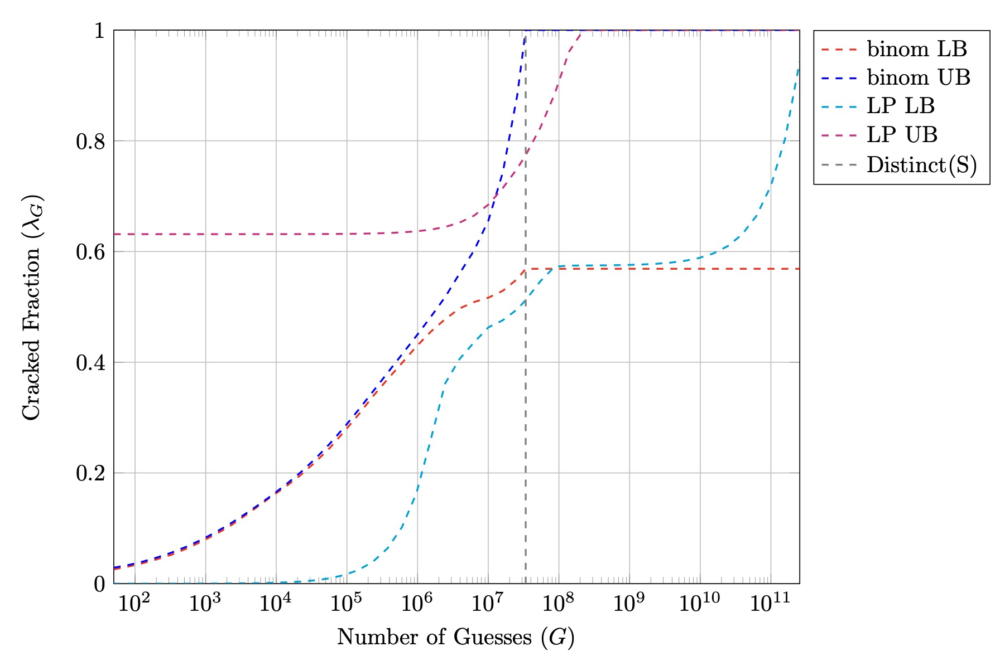

This is an example of how one might use the tools to analyze password samples. First, include the necessary files.

    #include <iostream>

    #include "distribution.hpp"
    #include "pwdio.hpp"
    #include "bounds.hpp"
    #include "lp_bounds.hpp"
    #include "wrappers.hpp"
    #include "plotting.hpp"

In the main function, first read the sample file into the `dist_t` object. Use the if statement to check if the sample was successfully read.

    dist_t yahoo_dist;
    if (read_file(yahoo_dist, "./dataset/yahoo_freqcount.txt", "freqcount")) {
      // successfully read sample
    }
    else {
      // handle failure reading from file
    }

Then, partition the sample into two sets, here we choose $d = 30000$ as the size of $D_{2}$.

    partition(yahoo_dist, (int64_t) 30000);

The following lines show how one can calculate bounds for specific $G$ values.

    int64_t G1 = 500000;
    int64_t G2 = 20000000000;
    double err = 0.01;
    std::cout << freq_UB(yahoo_dist, G1, err) << std::endl;
    std::cout << binom_LB(yahoo_dist, G2, err) << std::endl;

The results are `0.401` and `0.569`, indicating that $\Pr[\lambda_{5 \cdot 10^{5}} \leq 0.401] \geq 0.99$ and $\Pr[\lambda_{2 \cdot 10^{10}} \geq 0.569] \geq 0.99$.

The follow lines show how one can set the parameters for the linear programming bounds.

    int64_t total_samples = yahoo_dist.N;
    double q = 1.004;
    int64_t iprime = 5;
    std::vector<double> errs = {0.001, 0.0015, 0.0018, 0.0019, 0.002, 0.002};
    std::vector<double> xhats = {3.0/total_samples, 4.0/total_samples, 5.0/total_samples, 6.0/total_samples, 7.0/total_samples, 8.0/total_samples};
    int64_t G3 = 2000000000LL;
    std::cout << LP_LB(yahoo_dist, G3, q, iprime, errs, xhats) << std::endl;

The result is `0.577`, showing that $\Pr[\lambda_{2 \cdot 10^{9}} \geq 0.577] \geq 0.99$.

The following lines demonstrates how one might utilize the `tikz_plot()` function to generate a plot of the entire guessing curve.result

    std::vector<std::string> style = {"red,dashed,thick", "blue,dashed,thick", "cyan,dashed,thick", "magenta,dashed,thick", "gray,dashed,thick"};
    std::vector<std::string> legend = {"binom LB", "binom UB", "LP LB", "LP UB", "Distinct(S)"};
    std::vector<std::vector<std::pair<int64_t, double>>> data(5);
    for (int64_t G = 50; G < yahoo_dist.distinct; G *= 1.6) {
      std::cout << G << std::endl;
      data[0].push_back(std::make_pair(G, binom_LB(yahoo_dist, G, 0.01)));
      data[1].push_back(std::make_pair(G, binom_UB(yahoo_dist, G, 0.01)));
      data[2].push_back(std::make_pair(G, LP_LB(yahoo_dist, G, 0.01)));
      data[3].push_back(std::make_pair(G, LP_UB(yahoo_dist, G, 0.01)));
    }
    for (int64_t G = yahoo_dist.distinct; G <= 10000000000LL; G *= 1.6) {
      std::cout << G << std::endl;
      data[0].push_back(std::make_pair(G, binom_LB(yahoo_dist, G, 0.01)));
      data[1].push_back(std::make_pair(G, binom_UB(yahoo_dist, G, 0.01)));
      data[2].push_back(std::make_pair(G, LP_LB(yahoo_dist, G, 0.01)));
      data[3].push_back(std::make_pair(G, LP_UB(yahoo_dist, G, 0.01)));
    }
    data[4].push_back(std::make_pair(yahoo_dist.distinct, 0.0));
    data[4].push_back(std::make_pair(yahoo_dist.distinct, 1.0));

    tikz_plot(data, style, legend, "output/plot.txt");

The resulting plot is:

Finally, if the return value of the linear program bounds is `-2`, it means that the optimization problem was infeasible, indicating that the sample might not be taked *iid* from the distribution. In this case, the linkedin dataset contains duplicate accounts of the same user.

    dist_t linkedin_dist;
    read_file(linkedin_dist, "./dataset/linkedin_freqcount.txt", "freqcount");
    double result = LP_LB(linkedin_dist, (int64_t) 500000, 0.01);
    if (result == -2) {
      // infeasible LP
      std::cout << "Sample might not be iid!" << std::endl;
    }

